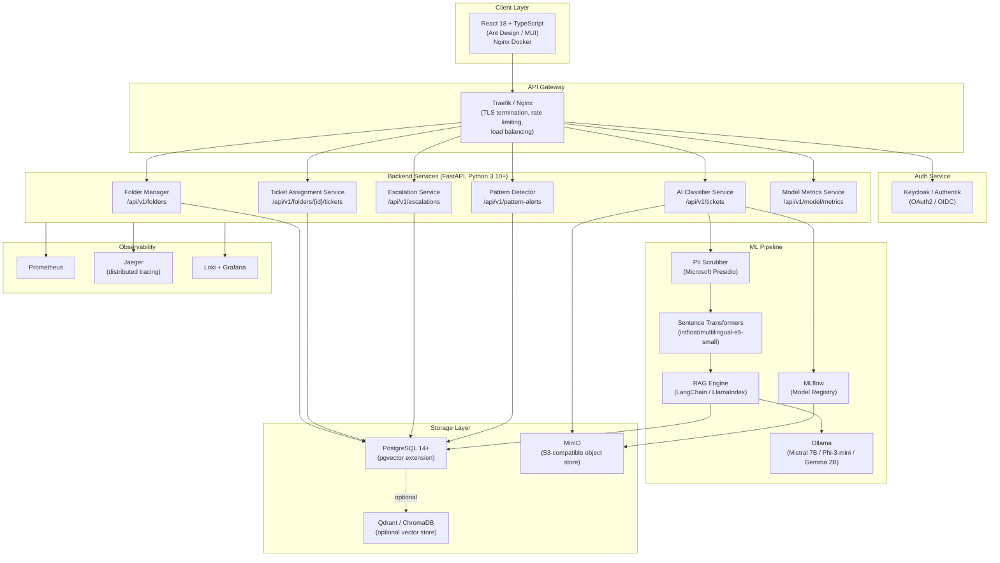
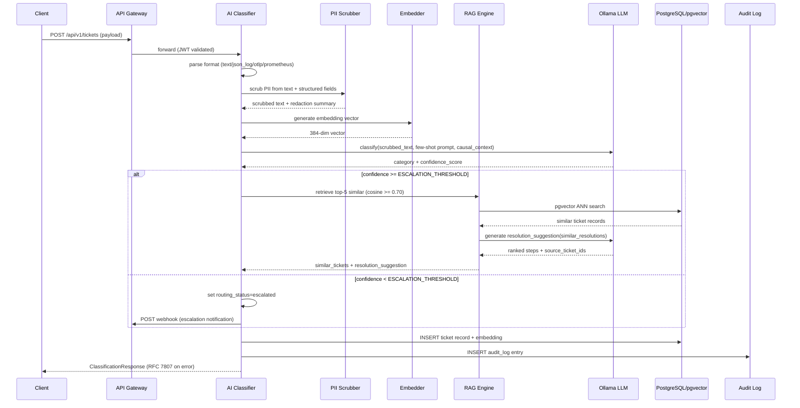
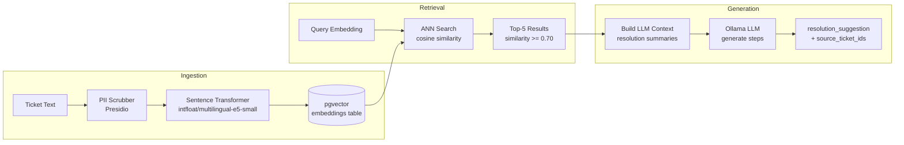
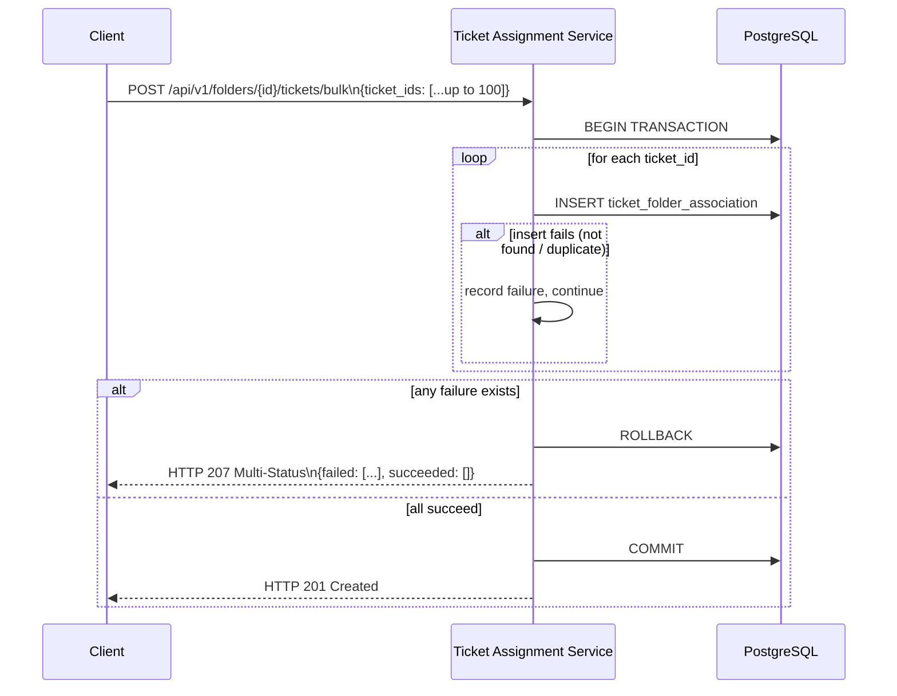
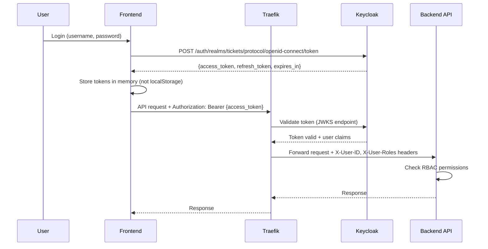

# Tickets Folder Feature — Architecture Document

> **Version:** 1.0  
> **Last Updated:** 2024-01-15  
> **Status:** Living Document

---

## Table of Contents

1. [Overview](#overview)
2. [System Architecture](#system-architecture)
3. [Component Diagrams](#component-diagrams)
4. [Data Flow](#data-flow)
5. [Layered Architecture](#layered-architecture)
6. [Service Communication](#service-communication)
7. [Data Models](#data-models)
8. [Security Architecture](#security-architecture)
9. [Observability Architecture](#observability-architecture)
10. [SLO Targets](#slo-targets)
11. [Deployment Architecture](#deployment-architecture)
12. [Scalability Considerations](#scalability-considerations)

---

## Overview

The Tickets Folder feature is a self-hosted AI-powered IT ticket routing and resolution platform. The system follows a microservices-inspired architecture with strict layering, zero external API dependencies, and observability-first design principles.

### Design Principles

1. **Zero External Dependencies** — All AI inference runs locally via Ollama; no cloud API calls
2. **Layered Architecture** — Strict unidirectional imports: `api → services → repositories → ml → schemas`
3. **Transactional Integrity** — Bulk operations are atomic; soft-delete cascades within single transactions
4. **Observability-First** — Every service exposes Prometheus metrics, OpenTelemetry traces, and structured JSON logs
5. **Security by Default** — OAuth2/OIDC, RBAC, PII scrubbing, mTLS, audit logging
6. **Fail-Safe Operations** — Graceful degradation on classifier timeout; escalation on low confidence

---

## System Architecture

### High-Level Component Diagram



### Component Responsibilities

| Component | Responsibility | Technology |
|-----------|---------------|------------|
| **React UI** | User interface, form handling, state management | React 18, TypeScript, Zustand, TanStack Query |
| **Traefik Gateway** | TLS termination, routing, rate limiting, load balancing | Traefik v3 |
| **Keycloak** | OAuth2/OIDC authentication, user management, RBAC | Keycloak or Authentik |
| **Folder Manager** | Folder CRUD, soft-delete, optimistic locking | FastAPI, SQLAlchemy |
| **Ticket Assignment** | Assign/remove tickets, bulk operations, pagination | FastAPI, SQLAlchemy |
| **AI Classifier** | Ticket classification, confidence scoring, routing | FastAPI, Ollama, sentence-transformers |
| **RAG Engine** | Similarity search, resolution suggestion generation | LangChain/LlamaIndex, pgvector |
| **PII Scrubber** | PII detection and redaction before embedding | Microsoft Presidio |
| **Escalation Service** | Low-confidence ticket routing, webhook notifications | FastAPI, async HTTP client |
| **Pattern Detector** | Recurring issue clustering, alert management | FastAPI, scikit-learn |
| **PostgreSQL** | Primary data store, vector embeddings (pgvector) | PostgreSQL 14+ with pgvector |
| **MinIO** | Object storage for datasets, models, backups | MinIO (S3-compatible) |
| **Ollama** | Local LLM inference | Ollama (Mistral 7B, Phi-3-mini, Gemma 2B) |
| **MLflow** | Model registry, experiment tracking, metrics | MLflow |
| **Prometheus** | Metrics collection and alerting | Prometheus |
| **Jaeger** | Distributed tracing | Jaeger (OTLP) |
| **Loki + Grafana** | Log aggregation and visualization | Loki, Grafana |

---

## Component Diagrams

### Ticket Classification Data Flow



### RAG Pipeline Data Flow



### Bulk Ticket Assignment Sequence



---

## Data Flow

### Request Flow (Typical Ticket Submission)

1. **Client** submits ticket via React UI
2. **Traefik** terminates TLS, validates rate limit, forwards to backend
3. **Keycloak** validates JWT token, extracts user roles
4. **API Router** (`api/tickets.py`) receives request, validates schema (Pydantic)
5. **Ticket Service** (`services/ticket_service.py`) orchestrates classification pipeline
6. **PII Scrubber** (`ml/pii_scrubber.py`) detects and redacts PII entities
7. **Embedding Service** (`ml/embedding_service.py`) generates 384-dim vector
8. **Classifier** (`ml/classifier.py`) calls Ollama LLM for category + confidence
9. **RAG Service** (`ml/rag_service.py`) retrieves similar tickets if confidence ≥ threshold
10. **Repository** (`repositories/ticket_repository.py`) persists ticket + embedding to PostgreSQL
11. **Audit Log** (`repositories/audit_repository.py`) writes audit entry
12. **Response** returns classification result to client (RFC 7807 on error)

### Data Persistence Flow

```
User Input → Pydantic Validation → Service Layer → Repository Layer → PostgreSQL
                                                                    ↓
                                                              Audit Log (append-only)
```

---

## Layered Architecture

The backend follows a strict layered architecture with unidirectional imports:

```
api/          ← FastAPI routers (HTTP boundary)
  └── services/     ← business logic, orchestration
        └── repositories/  ← database access (SQLAlchemy async)
              └── ml/            ← AI/ML pipeline (Ollama, embeddings, RAG)
                    └── schemas/       ← Pydantic v2 models (shared DTOs)
```

### Import Rules

| Layer | Can Import From | Cannot Import From |
|-------|----------------|-------------------|
| `api/` | `services/`, `schemas/` | `repositories/`, `ml/` |
| `services/` | `repositories/`, `ml/`, `schemas/` | `api/` |
| `repositories/` | `ml/`, `schemas/` | `api/`, `services/` |
| `ml/` | `schemas/` | `api/`, `services/`, `repositories/` |
| `schemas/` | (none) | All other layers |

### Layer Responsibilities

**API Layer (`api/`)**
- HTTP request/response handling
- JWT authentication and authorization
- Input validation (Pydantic schemas)
- RFC 7807 error formatting
- Rate limiting enforcement

**Service Layer (`services/`)**
- Business logic orchestration
- Transaction management
- Cross-repository coordination
- Retry logic and circuit breakers
- Event emission (audit logs)

**Repository Layer (`repositories/`)**
- Database CRUD operations
- Query optimization
- Connection pooling
- Transaction boundaries
- SQLAlchemy ORM mapping

**ML Layer (`ml/`)**
- LLM inference (Ollama)
- Embedding generation (sentence-transformers)
- RAG pipeline (retrieval + generation)
- PII detection and scrubbing (Presidio)
- Pattern detection (clustering)

**Schema Layer (`schemas/`)**
- Pydantic v2 models
- Request/response DTOs
- Validation rules
- Serialization logic

---

## Service Communication

### Internal Communication Matrix

| From | To | Protocol | Auth | Purpose |
|------|----|----------|------|---------|
| Traefik | api | HTTP/2 | JWT validation | API requests |
| api | postgres | TCP (asyncpg) | DB credentials | Data persistence |
| api | ollama | HTTP | none (internal) | LLM inference |
| api | minio | HTTPS (S3) | Access key | Object storage |
| api | keycloak | HTTPS (OIDC) | Client credentials | Token validation |
| api | mlflow | HTTP | none (internal) | Model registry |
| api | prometheus | HTTP | none (internal) | Metrics scraping |
| api | jaeger | gRPC (OTLP) | none (internal) | Trace export |
| frontend | traefik | HTTPS | Bearer token | User requests |

### Network Segmentation

```
┌─────────────────────────────────────────────────────────┐
│ Public Network (Internet)                               │
│   ↓ HTTPS (TLS 1.2+)                                   │
├─────────────────────────────────────────────────────────┤
│ DMZ (Traefik Gateway)                                   │
│   ↓ HTTP/2 (internal)                                  │
├─────────────────────────────────────────────────────────┤
│ Application Network (Backend Services)                  │
│   - FastAPI (api)                                       │
│   - Ollama (ollama)                                     │
│   - MLflow (mlflow)                                     │
│   ↓ TCP/gRPC (internal)                                │
├─────────────────────────────────────────────────────────┤
│ Data Network (Storage Layer)                            │
│   - PostgreSQL (postgres)                               │
│   - MinIO (minio)                                       │
│   - Qdrant (qdrant) [optional]                         │
├─────────────────────────────────────────────────────────┤
│ Observability Network                                   │
│   - Prometheus (prometheus)                             │
│   - Jaeger (jaeger)                                     │
│   - Loki (loki)                                         │
│   - Grafana (grafana)                                   │
└─────────────────────────────────────────────────────────┘
```

---

## Data Models

### Entity Relationship Diagram

```mermaid
erDiagram
    users {
        uuid id PK
        string email
        string role
        timestamp created_at
    }

    folders {
        uuid id PK
        string name
        uuid owner_id FK
        timestamp created_at
        timestamp updated_at
        timestamp deleted_at
        int version
    }

    tickets {
        uuid id PK
        string title
        text description
        text raw_payload
        string input_format
        string category
        string status
        string priority
        string routing_status
        float confidence_score
        jsonb causal_context
        string parse_warning
        timestamp created_at
        timestamp updated_at
    }

    ticket_folder_associations {
        uuid ticket_id FK
        uuid folder_id FK
        timestamp assigned_at
    }

    embedding_records {
        uuid ticket_id FK
        vector embedding
        string model_version
        timestamp created_at
    }

    audit_log {
        uuid id PK
        uuid actor_user_id FK
        string action_type
        uuid resource_id
        timestamp timestamp
        inet source_ip
        jsonb metadata
    }

    pattern_alerts {
        uuid id PK
        int cluster_size
        string representative_title
        string category
        timestamp window_start
        timestamp window_end
        string status
        timestamp snoozed_until
        timestamp created_at
        timestamp updated_at
    }

    override_labels {
        uuid id PK
        uuid ticket_id FK
        uuid agent_user_id FK
        string original_category
        string corrected_category
        timestamp created_at
    }

    users ||--o{ folders : "owns"
    folders ||--o{ ticket_folder_associations : "contains"
    tickets ||--o{ ticket_folder_associations : "assigned to"
    tickets ||--|| embedding_records : "has embedding"
    tickets ||--o{ override_labels : "overridden by"
    users ||--o{ override_labels : "submitted by"
    users ||--o{ audit_log : "actor"
```



### Key Indexes

```sql
-- ANN vector search (pgvector)
CREATE INDEX idx_embeddings_vector ON embedding_records
  USING ivfflat (embedding vector_cosine_ops) WITH (lists = 100);

-- Folder list queries
CREATE INDEX idx_folders_owner_deleted ON folders (owner_id, deleted_at, created_at DESC);
CREATE UNIQUE INDEX idx_folders_owner_name ON folders (owner_id, lower(name))
  WHERE deleted_at IS NULL;

-- Ticket-folder association lookups
CREATE INDEX idx_tfa_folder_assigned ON ticket_folder_associations (folder_id, assigned_at DESC);
CREATE INDEX idx_tfa_ticket ON ticket_folder_associations (ticket_id);

-- Audit log queries
CREATE INDEX idx_audit_resource ON audit_log (resource_id, timestamp DESC);
CREATE INDEX idx_audit_actor ON audit_log (actor_user_id, timestamp DESC);

-- Escalation queue
CREATE INDEX idx_tickets_routing_status ON tickets (routing_status, created_at ASC)
  WHERE routing_status = 'escalated';

-- Pattern detection
CREATE INDEX idx_tickets_category_created ON tickets (category, created_at DESC);
```

---

## Security Architecture

### Authentication Flow



### Role-Based Access Control (RBAC)

| Role | Permissions |
|------|------------|
| **viewer** | Read tickets, folders, classification results |
| **agent** | viewer + Create/assign tickets, override classifications, manage own folders |
| **manager** | agent + Manage all folders, pattern alerts, escalation queue |
| **admin** | manager + Model metrics, system configuration, user management |

### Security Layers

1. **Transport Security**
   - TLS 1.2+ for all external connections
   - mTLS for inter-service communication (optional)
   - HSTS headers enforced by Traefik

2. **Application Security**
   - JWT Bearer token authentication
   - CSRF protection on state-mutating endpoints
   - Per-user rate limiting (60 req/min default)
   - Input validation with Pydantic v2
   - SQL injection prevention via parameterized queries
   - XSS prevention via HTML sanitization

3. **Data Security**
   - AES-256 encryption at rest (PostgreSQL, MinIO)
   - PII scrubbing before embedding generation
   - Audit log with append-only enforcement (PostgreSQL RLS)
   - Secrets management via Infisical/Vault (production)

4. **Network Security**
   - Network segmentation (DMZ, app, data, observability)
   - Firewall rules (Docker network policies)
   - No direct internet access from backend services

---

## Observability Architecture

### Three Pillars of Observability

```
┌─────────────────────────────────────────────────────────┐
│ Metrics (Prometheus)                                    │
│   - Request rate, error rate, latency (RED)            │
│   - Resource utilization (CPU, memory, disk)           │
│   - Business metrics (tickets/day, escalation rate)    │
└─────────────────────────────────────────────────────────┘
                          ↓
┌─────────────────────────────────────────────────────────┐
│ Traces (Jaeger)                                         │
│   - Distributed request tracing                         │
│   - Span relationships and timing                       │
│   - Error propagation and root cause                    │
└─────────────────────────────────────────────────────────┘
                          ↓
┌─────────────────────────────────────────────────────────┐
│ Logs (Loki)                                             │
│   - Structured JSON logs                                │
│   - Trace ID correlation                                │
│   - Error details and stack traces                      │
└─────────────────────────────────────────────────────────┘
                          ↓
┌─────────────────────────────────────────────────────────┐
│ Visualization (Grafana)                                 │
│   - Unified dashboards                                  │
│   - Alerting rules                                      │
│   - SLO tracking                                        │
└─────────────────────────────────────────────────────────┘
```

### Prometheus Metrics

| Metric | Type | Labels | Description |
|--------|------|--------|-------------|
| `http_requests_total` | Counter | `method`, `path`, `status` | Total HTTP requests |
| `http_request_duration_seconds` | Histogram | `method`, `path` | Request latency (p50/p95/p99) |
| `classifier_confidence_score` | Histogram | `category` | Distribution of confidence scores |
| `classifier_category_total` | Counter | `category` | Predictions per category |
| `escalation_queue_depth` | Gauge | — | Current escalation queue size |
| `pattern_alert_count` | Gauge | `status` | Active pattern alerts by status |
| `pii_redactions_total` | Counter | `entity_type` | PII entities redacted |
| `rag_retrieval_duration_seconds` | Histogram | — | Vector search latency |
| `bulk_assign_batch_size` | Histogram | — | Bulk assign request sizes |
| `webhook_delivery_failures_total` | Counter | — | Escalation webhook failures |

### OpenTelemetry Tracing

Key spans instrumented:
- `folder.create`, `folder.list`, `folder.rename`, `folder.delete`
- `ticket.classify` (includes child spans: `pii.scrub`, `embed.generate`, `llm.infer`, `rag.retrieve`, `rag.generate`)
- `bulk_assign.transaction`
- `pattern_detector.scan`

Trace context propagation: W3C `traceparent` headers  
Export: OTLP gRPC to Jaeger on port 4317

### Structured Logging

Log format (JSON):
```json
{
  "timestamp": "2024-01-15T10:30:00Z",
  "level": "INFO",
  "service": "ai-classifier",
  "trace_id": "abc123",
  "span_id": "def456",
  "event": "ticket.classified",
  "ticket_id": "uuid",
  "category": "Infrastructure",
  "confidence_score": 0.87,
  "duration_ms": 1240
}
```

---

## SLO Targets

### Latency SLOs

| Operation | p50 | p95 | p99 | Notes |
|-----------|-----|-----|-----|-------|
| Folder CRUD | ≤ 100 ms | ≤ 250 ms | ≤ 500 ms | Create, list, rename, delete |
| Ticket classification (full pipeline) | ≤ 2 s | ≤ 4 s | ≤ 6 s | Includes PII scrubbing, embedding, LLM inference, RAG retrieval |
| RAG vector search (top-5) | — | — | ≤ 500 ms | 1M corpus with pgvector ivfflat index |
| Bulk assign (100 tickets) | — | — | ≤ 2 s | Atomic transaction with rollback |

### Availability SLOs

| Service | Target | Measurement Window |
|---------|--------|-------------------|
| API Gateway | 99.9% | 30 days |
| Backend API | 99.5% | 30 days |
| PostgreSQL | 99.9% | 30 days |
| Ollama | 99.0% | 30 days |

### Throughput Targets

- Concurrent users: 100+ (with horizontal scaling)
- Tickets per day: 10,000+ (single instance)
- Classification requests per second: 5-10 (limited by LLM inference)

### Error Budget

- API 5xx errors: < 0.1% of requests
- Classification failures: < 1% of requests (with escalation fallback)
- Webhook delivery failures: < 5% of attempts (with retry)

---

## Deployment Architecture

### Docker Compose Service Topology

```yaml
services:
  traefik:          # API Gateway
  frontend:         # React 18 UI (Nginx)
  api:              # FastAPI backend
  postgres:         # PostgreSQL 14 + pgvector
  ollama:           # Ollama LLM server
  minio:            # MinIO object storage
  keycloak:         # OAuth2/OIDC identity provider
  mlflow:           # MLflow tracking server
  qdrant:           # Qdrant vector DB (optional, profile: vector-store)
  prometheus:       # Metrics collection
  jaeger:           # Distributed tracing
  loki:             # Log aggregation
  grafana:          # Visualization and dashboards
  promtail:         # Log shipper (Loki agent)
```

### Volume Management

| Volume | Purpose | Backup Strategy |
|--------|---------|----------------|
| `postgres_data` | PostgreSQL data directory | Daily pg_dump to MinIO, 30-day retention |
| `minio_data` | Object storage (datasets, models, backups) | Replicate to secondary MinIO instance |
| `ollama_models` | Downloaded LLM models | Rebuild from Ollama registry |

### Health Checks

| Service | Health Check | Interval | Timeout |
|---------|-------------|----------|---------|
| api | `GET /health/ready` | 10s | 5s |
| postgres | `pg_isready` | 10s | 5s |
| ollama | `GET /api/tags` | 30s | 10s |
| minio | `GET /minio/health/live` | 10s | 5s |
| keycloak | `GET /health/ready` | 10s | 5s |

---

## Scalability Considerations

### Horizontal Scaling

**Stateless Services (can scale horizontally):**
- FastAPI backend (api) — scale to N replicas behind Traefik load balancer
- Frontend (Nginx) — scale to N replicas
- Ollama — scale to N replicas with model caching

**Stateful Services (vertical scaling or clustering):**
- PostgreSQL — vertical scaling or read replicas for queries
- MinIO — distributed mode with 4+ nodes for HA
- Keycloak — clustered mode with shared PostgreSQL

### Bottlenecks and Mitigation

| Bottleneck | Mitigation Strategy |
|------------|-------------------|
| LLM inference latency | Use smaller models (phi3-mini), batch requests, GPU acceleration |
| Vector search latency | Optimize pgvector index (tune `lists` parameter), consider Qdrant |
| Database connections | Connection pooling (asyncpg), read replicas for queries |
| Webhook delivery | Async task queue (Celery/RQ), exponential backoff |
| Pattern detection | Run as scheduled job (cron), not on request path |

### Caching Strategy

| Layer | Cache | TTL | Invalidation |
|-------|-------|-----|-------------|
| API | Redis (optional) | 5 min | On write operations |
| Embeddings | In-memory LRU | 1 hour | On model update |
| Folder list | TanStack Query (frontend) | 30 s | On mutation |
| Classification results | None | — | Immutable after creation |

---

## Appendix

### Technology Stack Summary

**Backend:** FastAPI, Python 3.10+, SQLAlchemy, asyncpg, Pydantic v2  
**Frontend:** React 18, TypeScript, Vite, Zustand, TanStack Query, Ant Design  
**Database:** PostgreSQL 14+ with pgvector extension  
**AI/ML:** Ollama, sentence-transformers, LangChain, Microsoft Presidio, MLflow  
**Infrastructure:** Docker Compose, Traefik, Keycloak, MinIO  
**Observability:** Prometheus, Jaeger, Loki, Grafana  
**Testing:** pytest, Hypothesis, Vitest, Playwright

### Reference Documents

- **[design.md](.kiro/specs/tickets-folder/design.md)** — Detailed technical design
- **[requirements_v2_1.md](requirements_v2_1.md)** — Complete requirements specification
- **[tasks.md](.kiro/specs/tickets-folder/tasks.md)** — Implementation task list
- **[MODEL_CARD.md](MODEL_CARD.md)** — AI model documentation
- **[DATASET_LICENSES.md](DATASET_LICENSES.md)** — Open-source licenses

---

*End of Architecture Document*
