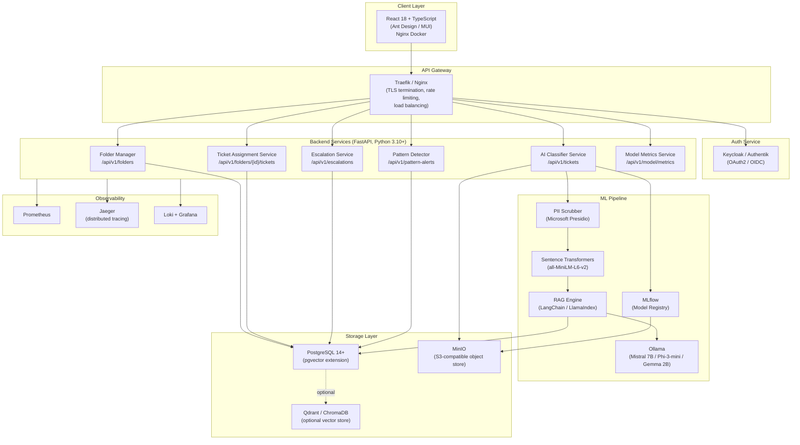
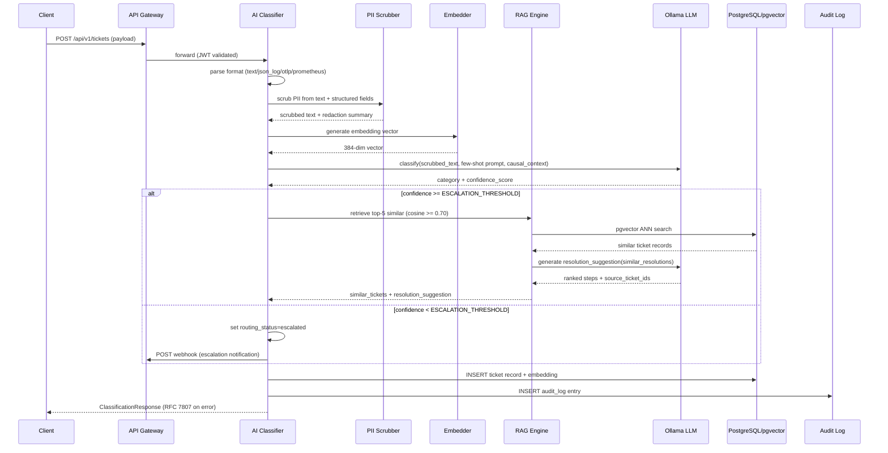
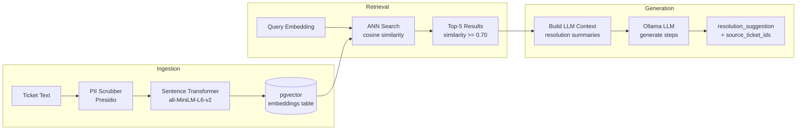
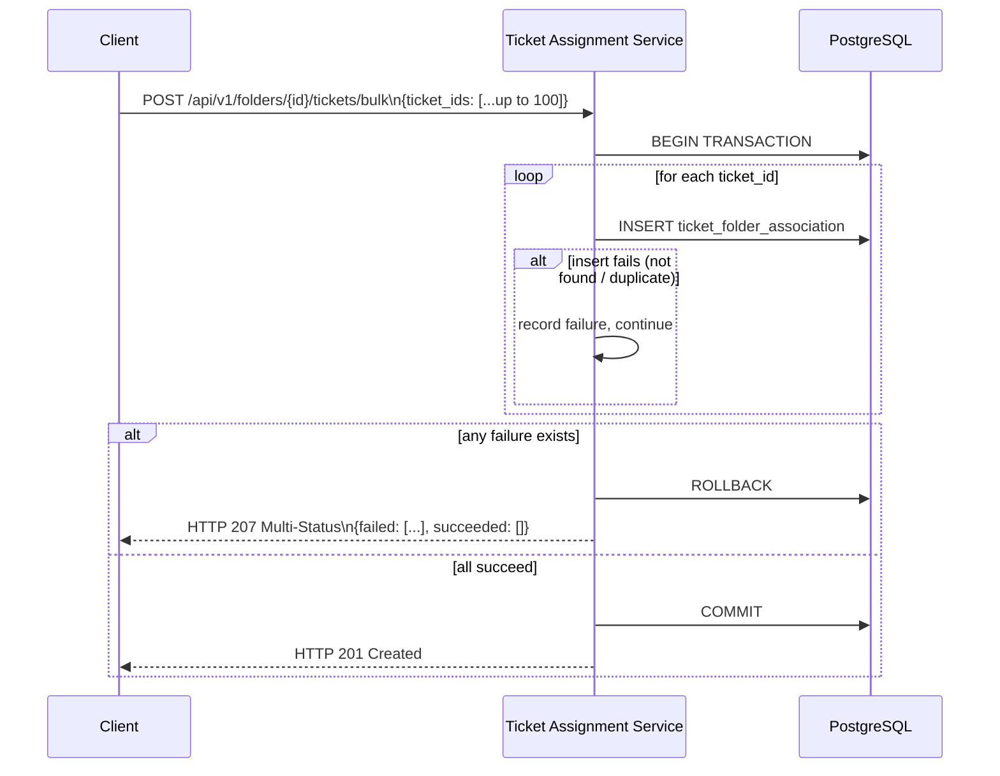
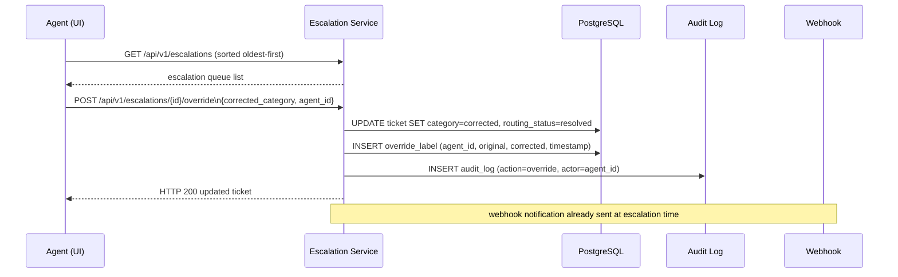
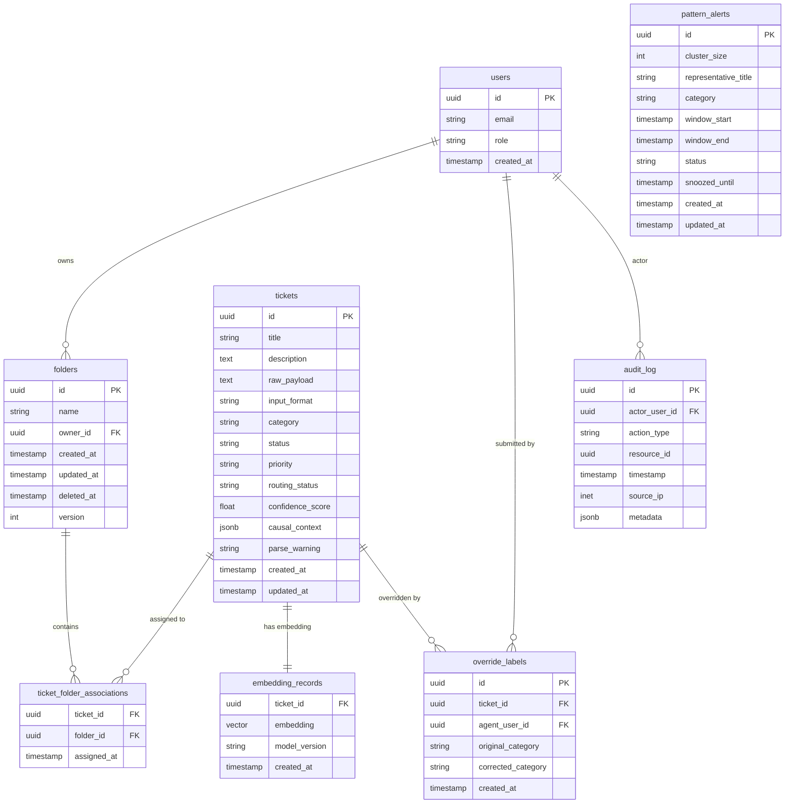

# Tickets Folder Feature — Design Document

> **Source of truth:** requirements_v2_1.md  
> **Stack:** FastAPI · PostgreSQL 14+ / pgvector · Ollama (Mistral 7B / Phi-3-mini / Gemma 2B) · React 18 + TypeScript · Docker Compose

---

## Overview

The Tickets Folder feature is an AI-powered IT ticket routing and resolution platform. It accepts support tickets in multiple formats (free text, JSON logs, OTLP traces, Prometheus alerts), classifies them into one of seven categories using a locally-hosted LLM, retrieves semantically similar resolved tickets via a RAG pipeline, suggests resolution steps, escalates low-confidence tickets for human review, and detects recurring issue patterns. Users can organise tickets into named folders for workflow management.

The system is fully self-hosted with zero external API dependencies. All AI inference runs via Ollama. All data remains on-premises.

### Design Goals

- **Zero external API dependencies** — all LLM inference via local Ollama; all embeddings via local sentence-transformers.
- **Layered architecture** — strict `api → services → repositories → ml → schemas` import direction.
- **Transactional integrity** — bulk operations are atomic; soft-delete cascades within a single transaction.
- **Observability-first** — every service exposes Prometheus metrics, OpenTelemetry traces, and structured JSON logs.
- **Security by default** — OAuth2/OIDC via Keycloak/Authentik, RBAC, PII scrubbing before any embedding, mTLS between services.

---

## Architecture

### High-Level Component Diagram



### Ticket Classification Data Flow



### RAG Pipeline Data Flow



### Bulk Ticket Assignment Sequence



### Escalation Override Sequence



---

## Components and Interfaces

### Backend Service Layer (FastAPI, Python 3.10+)

The backend follows a strict layered architecture with one-directional imports:

```
api/          ← FastAPI routers (HTTP boundary)
  └── services/     ← business logic, orchestration
        └── repositories/  ← database access (SQLAlchemy async)
              └── ml/            ← AI/ML pipeline (Ollama, embeddings, RAG)
                    └── schemas/       ← Pydantic v2 models (shared DTOs)
```

#### Folder Manager (`api/routers/folders.py`)

| Method | Path | Auth Role | Description |
|--------|------|-----------|-------------|
| POST | `/api/v1/folders` | agent, manager, admin | Create folder |
| GET | `/api/v1/folders` | viewer+ | List folders (paginated, filterable) |
| PATCH | `/api/v1/folders/{id}` | agent, manager, admin | Rename folder (optimistic lock) |
| DELETE | `/api/v1/folders/{id}` | manager, admin | Soft-delete folder |

#### Ticket Assignment Service (`api/routers/ticket_assignments.py`)

| Method | Path | Auth Role | Description |
|--------|------|-----------|-------------|
| POST | `/api/v1/folders/{id}/tickets/{ticket_id}` | agent+ | Assign ticket to folder |
| DELETE | `/api/v1/folders/{id}/tickets/{ticket_id}` | agent+ | Remove ticket from folder |
| GET | `/api/v1/folders/{id}/tickets` | viewer+ | List tickets in folder (paginated) |
| POST | `/api/v1/folders/{id}/tickets/bulk` | agent+ | Bulk assign (atomic, up to 100) |

#### AI Classifier Service (`api/routers/tickets.py`)

| Method | Path | Auth Role | Description |
|--------|------|-----------|-------------|
| POST | `/api/v1/tickets` | agent+ | Submit ticket, trigger classification |
| GET | `/api/v1/tickets/{id}/classification` | viewer+ | Get classification result |
| GET | `/api/v1/escalations` | agent, manager, admin | List escalation queue |
| POST | `/api/v1/escalations/{id}/override` | agent, manager, admin | Override routing decision |
| GET | `/api/v1/pattern-alerts` | manager, admin | List pattern alerts |
| PATCH | `/api/v1/pattern-alerts/{id}` | manager, admin | Dismiss / snooze / acknowledge |
| GET | `/api/v1/model/metrics` | agent, admin | AI model performance metrics |

#### Health Endpoints

| Method | Path | Description |
|--------|------|-------------|
| GET | `/health/live` | Liveness — process running |
| GET | `/health/ready` | Readiness — DB + services reachable |

### Request / Response Contracts

All error responses conform to RFC 7807:

```json
{
  "type": "https://tickets.example.com/errors/duplicate-folder-name",
  "title": "Duplicate Folder Name",
  "status": 409,
  "detail": "A folder named 'Infrastructure Issues' already exists for this user."
}
```

Classification response shape:

```json
{
  "ticket_id": "uuid",
  "category": "Infrastructure",
  "confidence_score": 0.87,
  "routing_status": "routed",
  "causal_signal": "error_rate_spike detected in service: api-gateway",
  "parse_warning": null,
  "similar_tickets": [
    {
      "ticket_id": "uuid",
      "title": "API gateway 502 errors",
      "category": "Infrastructure",
      "resolution_summary": "Restarted upstream pods...",
      "similarity_score": 0.91
    }
  ],
  "resolution_suggestion": {
    "steps": ["Check pod health...", "Review ingress logs..."],
    "source_ticket_ids": ["uuid1", "uuid2"],
    "low_retrieval_confidence": false
  }
}
```

### Frontend Components (React 18 + TypeScript)

| Component | Route | Role |
|-----------|-------|------|
| `TicketSubmissionForm` | `/tickets/new` | agent+ |
| `ClassificationResultPanel` | `/tickets/{id}` | viewer+ |
| `EscalationQueuePage` | `/escalations` | agent+ |
| `PatternAlertsPage` | `/pattern-alerts` | manager+ |
| `FolderSidebar` | (global layout) | viewer+ |
| `TicketListPage` | `/tickets` | viewer+ |
| `DashboardPage` | `/dashboard` | viewer+ |
| `ModelPerformancePage` | `/model/metrics` | agent, admin |

State management: Zustand for UI state; TanStack Query for all server state with automatic background refetch.

---

## Data Models

### Entity Relationship Diagram



### Schema Notes

- `folders.version` — optimistic locking counter; incremented on every write; mismatch returns HTTP 409.
- `folders.deleted_at` — soft-delete marker; NULL means active; non-NULL means deleted.
- `tickets.routing_status` — enum: `pending_classification | routed | escalated | resolved`.
- `tickets.input_format` — enum: `text | json_log | otlp_trace | prometheus_alert`.
- `embedding_records.embedding` — `vector(384)` column via pgvector; indexed with `ivfflat` for ANN search.
- `audit_log` — append-only; protected by PostgreSQL row-level security blocking UPDATE/DELETE.
- `pattern_alerts.status` — enum: `active | acknowledged | snoozed | dismissed`.

### Key Indexes

```sql
-- ANN vector search (pgvector)
CREATE INDEX idx_embeddings_vector ON embedding_records
  USING ivfflat (embedding vector_cosine_ops) WITH (lists = 100);

-- Folder list queries
CREATE INDEX idx_folders_owner_deleted ON folders (owner_id, deleted_at, created_at DESC);
CREATE UNIQUE INDEX idx_folders_owner_name ON folders (owner_id, lower(name))
  WHERE deleted_at IS NULL;

-- Ticket-folder association lookups
CREATE INDEX idx_tfa_folder_assigned ON ticket_folder_associations (folder_id, assigned_at DESC);
CREATE INDEX idx_tfa_ticket ON ticket_folder_associations (ticket_id);

-- Audit log queries
CREATE INDEX idx_audit_resource ON audit_log (resource_id, timestamp DESC);
CREATE INDEX idx_audit_actor ON audit_log (actor_user_id, timestamp DESC);
```

---

## Correctness Properties

*A property is a characteristic or behavior that should hold true across all valid executions of a system — essentially, a formal statement about what the system should do. Properties serve as the bridge between human-readable specifications and machine-verifiable correctness guarantees.*

The properties below are derived from the acceptance criteria prework analysis. Each is universally quantified and implementable as a Hypothesis property-based test.

---

### Property 1: Folder Name Validation

*For any* string that is either empty (after whitespace stripping) or longer than 255 characters, the Folder_Manager SHALL reject the create and rename operations with a validation error, and no folder record SHALL be created or modified.

**Validates: Requirements 1.2, 1.5, 3.2**

---

### Property 2: Duplicate Folder Name Rejection

*For any* user and any folder name, if a folder with that name (case-insensitively) already exists and is not soft-deleted, then attempting to create or rename another folder to that same name SHALL return a duplicate-name error and leave the folder count unchanged.

**Validates: Requirements 1.3, 3.3**

---

### Property 3: Folder Creation Round-Trip

*For any* valid folder name submitted by a user, the created folder record returned SHALL contain a non-null unique identifier, a non-null `created_at` timestamp, and a `name` equal to the whitespace-stripped input.

**Validates: Requirements 1.1, 1.4, 1.5**

---

### Property 4: Injection Payload Rejection

*For any* folder name string containing HTML tags (`<`, `>`) or script injection patterns (e.g., `<script>`, `javascript:`), the Folder_Manager SHALL reject the operation with a validation error and SHALL NOT persist the name.

**Validates: Requirements 1.6**

---

### Property 5: Folder List Completeness and Ownership

*For any* user with N active (non-deleted) folders, a list-folders request SHALL return exactly N folders, all with `owner_id` equal to the requesting user's ID, and none with a non-null `deleted_at`.

**Validates: Requirements 2.1, 4.4**

---

### Property 6: List Sort Order Invariant

*For any* list of folders returned by the Folder_Manager (default sort), the `created_at` values SHALL be in non-increasing (descending) order. *For any* list of tickets returned by the Ticket_Assignment_Service (default sort), the `assigned_at` values SHALL be in non-increasing order.

**Validates: Requirements 2.2, 7.4**

---

### Property 7: Cursor Pagination Completeness

*For any* user with N folders (or a folder with N tickets), paginating through all pages using cursor tokens with any valid page size SHALL yield exactly N items in total with no duplicates and no omissions.

**Validates: Requirements 2.4, 7.5**

---

### Property 8: Name Prefix Filter Correctness

*For any* prefix string P and any list of folders returned when filtering by P, every returned folder's name SHALL start with P (case-insensitively), and no folder whose name does not start with P SHALL appear in the results.

**Validates: Requirements 2.5**

---

### Property 9: Optimistic Locking Conflict

*For any* folder with version V, submitting a rename request with a version field not equal to V SHALL return HTTP 409 Conflict, and the folder's name and version SHALL remain unchanged.

**Validates: Requirements 3.5, 23.7**

---

### Property 10: Soft-Delete Visibility

*For any* folder, after a soft-delete operation: (a) the folder's `deleted_at` field SHALL be non-null; (b) the folder SHALL NOT appear in any list-folders response unless `include_deleted=true` is supplied by an admin; (c) a subsequent delete of the same folder SHALL return a not-found error.

**Validates: Requirements 4.1, 4.3, 4.4**

---

### Property 11: Soft-Delete Cascades Associations

*For any* folder with K ticket associations, after soft-deleting the folder, the count of ticket_folder_associations for that folder SHALL be zero, and none of the K tickets SHALL be deleted.

**Validates: Requirements 4.2**

---

### Property 12: Ticket Assignment Round-Trip

*For any* existing ticket and existing active folder, after a successful assignment, querying the folder's ticket list SHALL include that ticket, and the association record SHALL have a non-null `assigned_at` timestamp.

**Validates: Requirements 5.1**

---

### Property 13: Duplicate Assignment Rejection

*For any* ticket already assigned to a folder, attempting to assign the same ticket to the same folder again SHALL return an already-assigned error, and the association count for that folder SHALL remain unchanged.

**Validates: Requirements 5.2**

---

### Property 14: Bulk Assign Atomicity

*For any* bulk-assign request containing at least one invalid ticket ID (non-existent or already assigned), the entire batch SHALL be rolled back — zero new associations SHALL be created — and the response SHALL list the failing ticket IDs.

**Validates: Requirements 5.7, 30.6c**

---

### Property 15: Remove Association Round-Trip

*For any* ticket assigned to a folder, after removing the ticket from the folder, querying the folder's ticket list SHALL NOT include that ticket, and the ticket record itself SHALL be byte-for-byte identical to its state before removal.

**Validates: Requirements 6.1, 6.4**

---

### Property 16: Ticket Deletion Cascades Associations

*For any* ticket assigned to K folders, deleting the ticket SHALL remove all K associations within the same transaction, and all K folders SHALL remain intact with their other tickets unaffected.

**Validates: Requirements 8.1, 8.2**

---

### Property 17: Classification Output Invariant

*For any* ticket input (including empty strings, very long text, non-ASCII content, and structured payloads), the classifier SHALL return: (a) exactly one category from the set {Infrastructure, Application, Security, Database, Storage, Network, Access Management}; (b) a `confidence_score` that is a float in the closed interval [0.0, 1.0].

**Validates: Requirements 9.1, 9.3, 30.6a, 30.6b**

---

### Property 18: Structured Input Acceptance

*For any* well-formed payload in a recognised format (JSON log with ECS fields, OTLP trace with required fields, Prometheus Alertmanager payload), the system SHALL accept the ticket without error and SHALL populate the `causal_context` object in the response.

**Validates: Requirements 10.1, 10.2**

---

### Property 19: Unknown Format Fallback

*For any* payload that does not match any recognised structured format, the system SHALL accept it as plain text, SHALL NOT return an error, and SHALL include a non-null `parse_warning` field in the response.

**Validates: Requirements 10.4**

---

### Property 20: Invalid Schema Rejection

*For any* payload that matches a recognised format (JSON log, OTLP trace, or Prometheus alert) but is missing required fields, the system SHALL return HTTP 400 with an RFC 7807 body identifying the detected format and the specific missing fields, and SHALL NOT create a ticket record.

**Validates: Requirements 10.6**

---

### Property 21: RAG Retrieval Threshold Invariant

*For any* classified ticket, every entry in the `similar_tickets` array SHALL have a `similarity_score` ≥ 0.70, the array SHALL contain at most 5 entries, and if fewer than 2 entries are present, `low_retrieval_confidence` SHALL be `true`.

**Validates: Requirements 11.1, 11.5**

---

### Property 22: Resolution Suggestion Source Traceability

*For any* resolution suggestion returned, the `source_ticket_ids` array SHALL be non-empty and every ID in it SHALL correspond to a ticket that exists in the database and has `status = resolved`.

**Validates: Requirements 11.4**

---

### Property 23: Escalation Routing Invariant

*For any* ticket whose `confidence_score` is strictly less than `ESCALATION_THRESHOLD`, the ticket's `routing_status` SHALL be set to `escalated`, and the ticket SHALL appear in the escalation queue. *For any* ticket whose `confidence_score` is ≥ `ESCALATION_THRESHOLD`, `routing_status` SHALL NOT be `escalated`.

**Validates: Requirements 12.1**

---

### Property 24: Override Audit Record Completeness

*For any* agent override action, the resulting `override_labels` record SHALL contain: a non-null `agent_user_id`, a non-null `original_category` from the seven defined categories, a non-null `corrected_category` from the seven defined categories, and a non-null `created_at` timestamp. A corresponding audit_log entry SHALL also exist.

**Validates: Requirements 12.4, 28.1**

---

### Property 25: Pattern Cluster Detection

*For any* set of 3 or more resolved tickets within the configured sliding window that share the same category and have pairwise cosine similarity ≥ 0.80, the Pattern_Detector SHALL create exactly one `PatternAlert` record for that cluster, and the alert SHALL appear in the pattern-alerts API response.

**Validates: Requirements 13.2, 13.3**

---

### Property 26: PII Scrubbing Completeness

*For any* ticket text containing known PII entity types (email, phone, IP address, credit card, name), the scrubbed text returned by the PII pipeline SHALL not contain the original PII values, and each redacted span SHALL be replaced with a type-labelled placeholder (e.g., `[EMAIL]`, `[PHONE]`). The scrubbed text length SHALL be ≥ 0 (placeholders preserve structure rather than deleting spans).

**Validates: Requirements 17.1, 17.3**

---

## Error Handling

### Error Response Standard

All API error responses conform to RFC 7807 (Problem Details for HTTP APIs):

```json
{
  "type": "https://tickets.example.com/errors/{error-slug}",
  "title": "Human-readable title",
  "status": 422,
  "detail": "Specific description of what went wrong.",
  "instance": "/api/v1/folders/abc123"
}
```

### Error Catalogue

| Scenario | HTTP Status | Error Slug |
|----------|-------------|------------|
| Folder name empty / > 255 chars | 422 | `invalid-folder-name` |
| Folder name contains injection payload | 422 | `invalid-folder-name` |
| Duplicate folder name | 409 | `duplicate-folder-name` |
| Folder not found (or soft-deleted) | 404 | `folder-not-found` |
| Optimistic lock version mismatch | 409 | `version-conflict` |
| Folder limit (500) exceeded | 422 | `folder-limit-exceeded` |
| Ticket not found | 404 | `ticket-not-found` |
| Ticket already assigned to folder | 409 | `ticket-already-assigned` |
| Ticket not assigned to folder | 404 | `ticket-not-assigned` |
| Bulk assign > 100 tickets | 422 | `bulk-limit-exceeded` |
| Structured payload schema invalid | 400 | `invalid-payload-schema` |
| Classifier unavailable (timeout) | — | ticket created with `routing_status: pending_classification` |
| Retraining already in progress | 409 | `retrain-already-running` |
| Rate limit exceeded | 429 | `rate-limit-exceeded` (+ `Retry-After` header) |
| Unauthenticated | 401 | `unauthorized` |
| Insufficient role | 403 | `forbidden` |

### Classifier Unavailability

When Ollama does not respond within 5 seconds:
1. Ticket is persisted with `routing_status: pending_classification`.
2. A background task queues the ticket for retry with exponential backoff: delays of 5 s, 10 s, 20 s (max 3 retries).
3. If all retries are exhausted, `routing_status` is set to `escalated` and a `classifier_unavailable` audit event is written.
4. The API response to the client is HTTP 202 Accepted (not an error), with the ticket ID and `routing_status: pending_classification`.

### Webhook Delivery Failures

When the escalation webhook returns non-2xx or is unreachable:
1. Retry with exponential backoff: 10 s, 20 s, 40 s (max 3 retries).
2. On exhaustion, write `webhook_delivery_failed` audit event.
3. Ticket escalation proceeds normally — webhook failure does not block the escalation workflow.

### Database Unavailability

If PostgreSQL is unreachable at startup, the service logs a descriptive error and exits with code 1. During operation, database errors surface as HTTP 503 with a `service-unavailable` problem detail.

---

## Observability Design

### Prometheus Metrics

Each service exposes `/metrics` (Prometheus text format). Key metrics:

| Metric | Type | Labels | Description |
|--------|------|--------|-------------|
| `http_requests_total` | Counter | `method`, `path`, `status` | Total HTTP requests |
| `http_request_duration_seconds` | Histogram | `method`, `path` | Request latency (p50/p95/p99) |
| `classifier_confidence_score` | Histogram | `category` | Distribution of confidence scores |
| `classifier_category_total` | Counter | `category` | Predictions per category |
| `escalation_queue_depth` | Gauge | — | Current escalation queue size |
| `pattern_alert_count` | Gauge | `status` | Active pattern alerts by status |
| `pii_redactions_total` | Counter | `entity_type` | PII entities redacted |
| `rag_retrieval_duration_seconds` | Histogram | — | Vector search latency |
| `bulk_assign_batch_size` | Histogram | — | Bulk assign request sizes |
| `webhook_delivery_failures_total` | Counter | — | Escalation webhook failures |

### Distributed Tracing (OpenTelemetry → Jaeger)

All services instrument with the OpenTelemetry Python SDK. Trace context is propagated via W3C `traceparent` headers. Key spans:

- `folder.create`, `folder.list`, `folder.rename`, `folder.delete`
- `ticket.classify` (includes child spans: `pii.scrub`, `embed.generate`, `llm.infer`, `rag.retrieve`, `rag.generate`)
- `bulk_assign.transaction`
- `pattern_detector.scan`

Traces are exported to Jaeger via OTLP gRPC on port 4317.

### Structured Logging (Loki)

All services emit JSON-structured logs:

```json
{
  "timestamp": "2024-01-15T10:30:00Z",
  "level": "INFO",
  "service": "ai-classifier",
  "trace_id": "abc123",
  "span_id": "def456",
  "event": "ticket.classified",
  "ticket_id": "uuid",
  "category": "Infrastructure",
  "confidence_score": 0.87,
  "duration_ms": 1240
}
```

Logs are shipped to Loki via Promtail. Grafana dashboards query Loki for log-based alerting.

### Grafana Dashboard

A pre-built `grafana/dashboards/tickets-folder.json` covers:
- Request rate and error rate per endpoint
- p99 latency per endpoint (SLO: ≤ 500 ms for CRUD, ≤ 6 s for classification)
- Classifier confidence score distribution (histogram)
- Escalation queue depth over time
- Pattern alert count by status
- PII redaction rate by entity type
- Model F1 score trend (from MLflow metrics API)

### SLO Targets

| Operation | p50 | p95 | p99 |
|-----------|-----|-----|-----|
| Folder / ticket CRUD | ≤ 100 ms | ≤ 250 ms | ≤ 500 ms |
| Ticket classification (full pipeline) | ≤ 2 s | ≤ 4 s | ≤ 6 s |
| RAG vector search (top-5, 1M corpus) | — | — | ≤ 500 ms |

---

## Docker Compose Service Topology

```yaml
# docker-compose.yml — service topology overview
services:
  # API Gateway
  traefik:          # Traefik v3 — TLS termination, routing, rate limiting
    ports: [80, 443, 8080]

  # Backend Services
  api:              # FastAPI app — all routers (folders, tickets, escalations, patterns)
    depends_on: [postgres, ollama, minio, keycloak]
    environment: [DATABASE_URL, OLLAMA_BASE_URL, MINIO_ENDPOINT, ...]

  # AI/ML
  ollama:           # Ollama — serves Mistral 7B / Phi-3-mini / Gemma 2B
    volumes: [ollama_models:/root/.ollama]
    ports: [11434]

  mlflow:           # MLflow tracking server + model registry
    depends_on: [postgres, minio]
    ports: [5000]

  # Storage
  postgres:         # PostgreSQL 14 + pgvector extension
    volumes: [postgres_data:/var/lib/postgresql/data]
    ports: [5432]

  minio:            # MinIO S3-compatible object store
    volumes: [minio_data:/data]
    ports: [9000, 9001]  # API + console

  # Optional vector store (alternative to pgvector)
  qdrant:           # Qdrant vector database (optional)
    profiles: [vector-store]
    ports: [6333]

  # Auth
  keycloak:         # Keycloak OAuth2/OIDC identity provider
    depends_on: [postgres]
    ports: [8080]

  # Observability
  prometheus:       # Prometheus metrics scraper
    volumes: [./prometheus.yml:/etc/prometheus/prometheus.yml]
    ports: [9090]

  jaeger:           # Jaeger distributed tracing (all-in-one)
    ports: [16686, 4317]  # UI + OTLP gRPC

  loki:             # Loki log aggregation
    ports: [3100]

  grafana:          # Grafana dashboards
    depends_on: [prometheus, loki, jaeger]
    ports: [3000]

  # Frontend
  frontend:         # React 18 static build served by Nginx
    depends_on: [api]
    ports: [80]

volumes:
  postgres_data:
  minio_data:
  ollama_models:
```

### Service Communication Matrix

| From | To | Protocol | Auth |
|------|----|----------|------|
| Traefik | api | HTTP/2 | JWT validation |
| api | postgres | TCP (asyncpg) | DB credentials (Infisical) |
| api | ollama | HTTP | none (internal network) |
| api | minio | HTTPS (S3) | Access key (Infisical) |
| api | keycloak | HTTPS (OIDC) | Client credentials |
| api | mlflow | HTTP | none (internal network) |
| api → api (inter-service) | — | gRPC | mTLS |
| frontend | traefik | HTTPS | Bearer token |

---

## Testing Strategy

### Dual Testing Approach

Unit tests and property-based tests are complementary and both required:

- **Unit tests** — specific examples, integration points, error conditions, edge cases.
- **Property tests** — universal properties across randomly generated inputs (Hypothesis).

Together they provide comprehensive coverage: unit tests catch concrete bugs; property tests verify general correctness across the input space.

### Property-Based Testing (Hypothesis)

The system uses **Hypothesis** (MIT licence) for all property-based tests.

**Configuration:**
- Minimum 100 iterations per property test (`settings(max_examples=100)`).
- Each test is tagged with a comment referencing the design property.
- Tag format: `# Feature: tickets-folder, Property {N}: {property_text}`

**Example property test structure:**

```python
from hypothesis import given, settings, strategies as st

# Feature: tickets-folder, Property 17: Classification Output Invariant
@given(ticket_text=st.text(min_size=0, max_size=10_000))
@settings(max_examples=100)
def test_classification_output_invariant(ticket_text):
    result = classifier.classify(ticket_text)
    assert result.category in VALID_CATEGORIES
    assert 0.0 <= result.confidence_score <= 1.0
```

**Properties to implement as Hypothesis tests:**

| Property | Test File | Hypothesis Strategy |
|----------|-----------|---------------------|
| P1: Folder name validation | `tests/test_folder_manager.py` | `st.text()` with length filters |
| P2: Duplicate name rejection | `tests/test_folder_manager.py` | `st.text(min_size=1, max_size=255)` |
| P3: Folder creation round-trip | `tests/test_folder_manager.py` | `st.text(min_size=1, max_size=255)` |
| P4: Injection rejection | `tests/test_folder_manager.py` | `st.sampled_from(INJECTION_PAYLOADS)` |
| P5: List completeness | `tests/test_folder_manager.py` | `st.lists(st.text())` |
| P6: Sort order invariant | `tests/test_folder_manager.py` | `st.lists(st.builds(Folder, ...))` |
| P7: Pagination completeness | `tests/test_pagination.py` | `st.integers(min_value=1, max_value=200)` |
| P8: Name prefix filter | `tests/test_folder_manager.py` | `st.text()` |
| P9: Optimistic locking | `tests/test_folder_manager.py` | `st.integers()` |
| P10: Soft-delete visibility | `tests/test_folder_manager.py` | `st.builds(Folder, ...)` |
| P11: Soft-delete cascade | `tests/test_ticket_assignment.py` | `st.lists(st.uuids())` |
| P12: Assignment round-trip | `tests/test_ticket_assignment.py` | `st.uuids()` |
| P13: Duplicate assignment | `tests/test_ticket_assignment.py` | `st.uuids()` |
| P14: Bulk assign atomicity | `tests/test_ticket_assignment.py` | `st.lists(st.uuids(), max_size=100)` |
| P15: Remove round-trip | `tests/test_ticket_assignment.py` | `st.uuids()` |
| P16: Ticket deletion cascade | `tests/test_ticket_assignment.py` | `st.lists(st.uuids())` |
| P17: Classification output invariant | `tests/test_classifier.py` | `st.text()` |
| P18: Structured input acceptance | `tests/test_classifier.py` | `st.builds(OTLPPayload, ...)` |
| P19: Unknown format fallback | `tests/test_classifier.py` | `st.binary()` |
| P20: Invalid schema rejection | `tests/test_classifier.py` | `st.fixed_dictionaries({...})` |
| P21: RAG threshold invariant | `tests/test_rag_engine.py` | `st.text()` |
| P22: Resolution source traceability | `tests/test_rag_engine.py` | `st.text()` |
| P23: Escalation routing invariant | `tests/test_classifier.py` | `st.floats(min_value=0.0, max_value=1.0)` |
| P24: Override audit completeness | `tests/test_escalation.py` | `st.builds(OverrideRequest, ...)` |
| P25: Pattern cluster detection | `tests/test_pattern_detector.py` | `st.lists(st.builds(Ticket, ...), min_size=3)` |
| P26: PII scrubbing completeness | `tests/test_pii_scrubber.py` | `st.text()` with PII composites |

### Unit Tests

Unit tests focus on:
- Specific examples demonstrating correct behavior (e.g., exact RFC 7807 error shapes)
- Integration points between layers (e.g., repository → service boundary)
- Edge cases: empty folder, 500-folder limit, 0-ticket folder, classifier timeout fallback
- Error conditions: DB unavailable, Ollama timeout, webhook failure

**Framework:** pytest + pytest-asyncio + testcontainers-python (real PostgreSQL container for integration tests)

**Coverage targets:**
- Python backend: ≥ 80% line coverage (pytest-cov)
- React frontend: ≥ 75% line coverage (Vitest + v8)

### Integration Tests

Each classification, retrieval, and resolution suggestion endpoint is tested against a real PostgreSQL test container (testcontainers-python). These tests verify:
- End-to-end ticket submission → classification → RAG retrieval → response shape
- Bulk assign transaction rollback with a real DB
- Soft-delete cascade with a real DB
- Audit log entries written correctly

### End-to-End Tests

Playwright (Apache 2.0) covers critical user journeys:
- Ticket submission → classification result display
- Escalation queue review → override → confirmation toast
- Folder create → assign ticket → view folder contents
- Pattern alert acknowledge / snooze / dismiss
- Dashboard auto-refresh

### CI Pipeline

All tests run in Docker Compose without additional setup and produce JUnit XML output. The CI pipeline also runs:
- **Ruff** — Python linting (PEP 8, blocks merge on violation)
- **Bandit** — Python SAST (HIGH severity blocks merge)
- **Semgrep** — cross-language scanning (HIGH severity blocks merge)
- **Trivy** — container CVE scanning (CRITICAL blocks image promotion)
- **pytest-cov** — coverage report published as CI artefact

---

*End of Design Document*
