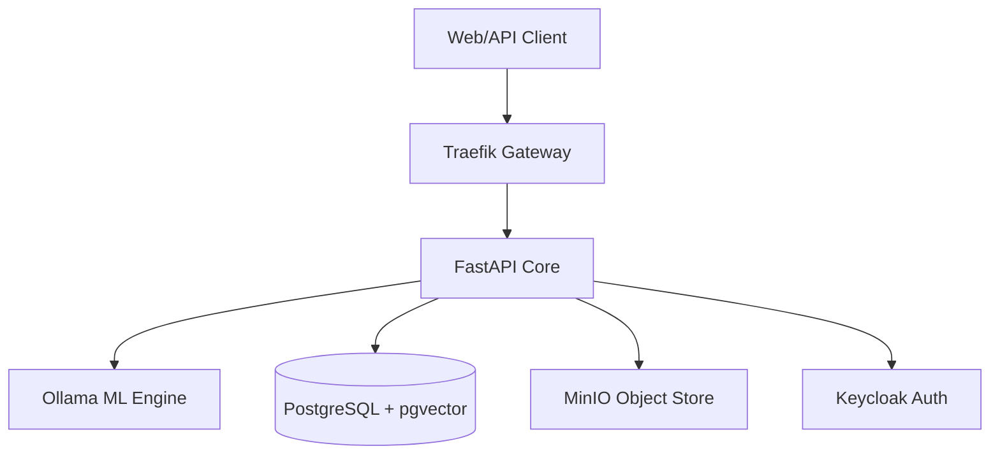
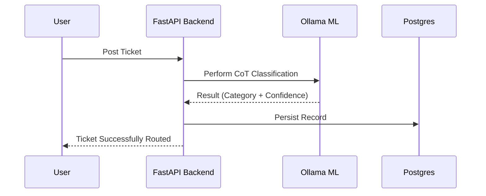
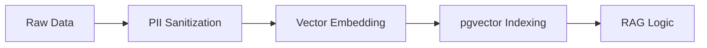
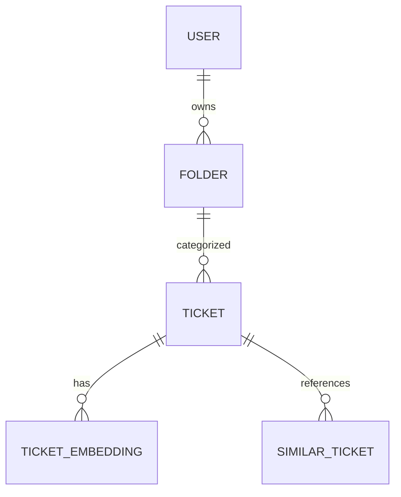
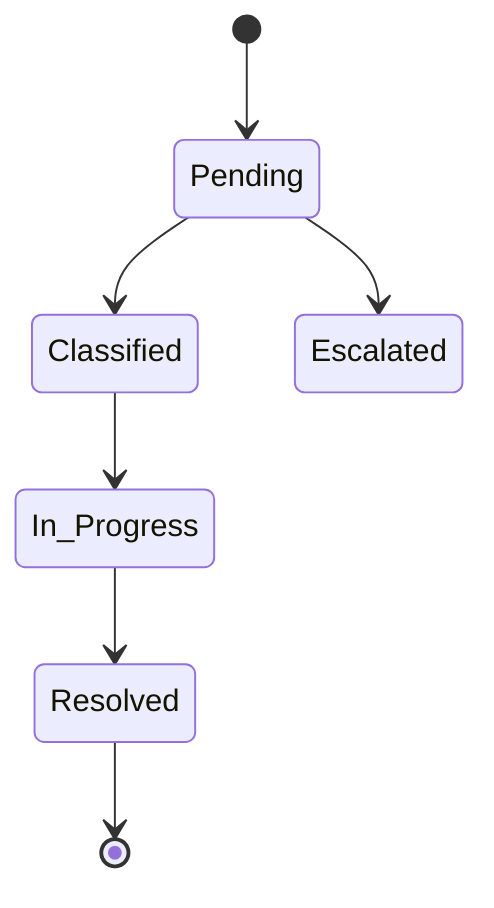

# TicketIQ: Enterprise Neural Intelligence Architecture

This document outlines the professional technical architecture of TicketIQ, an AIOps-driven Service Management framework. It focuses on modular scalability, data sovereignty, and reliable automated ticket orchestration.

---

## Part 1: System Infrastructure & Architecture
**The Core Foundation**

TicketIQ follows a **Microservices-based architecture** encapsulated in Docker containers. This ensures environment parity from local development to production. The system is brokered by **Traefik**, which serves as the high-availability API Gateway, managing entry points for all client requests.

The backend is built with **FastAPI**, leveraging Python's asynchronous capabilities to handle high-frequency AI inferences without blocking the primary request-response cycle. This architecture allows the system to scale horizontally by deploying multiple instances of the API and ML workers as traffic increases.

### Architecture Map

---

## Part 2: Neural Classification Pipeline
**Reliability-First Inference**

The classification pipeline is designed for high precision. When a ticket is received, it undergoes a multi-stage analysis:
1.  **Metadata Extraction**: Identifying title and description signals.
2.  **Semantic Enrichment**: Scrubbing PII and parsing structured causal data.
3.  **LLM Inference**: Categorizing the issue using Chain-of-Thought (CoT) logic.
4.  **Confidence Assessment**: Each inference is assigned a confidence score. If the score is marginal, the system triggers an **LLM-as-a-Judge** validation to confirm or flag the ticket for human review.

### Sequence Diagram: Classification Flow

---

## Part 3: Data Engineering & Governance
**Secure Pipeline Management**

Data integrity and privacy are the core of TicketIQ. The **Data Engineering Pipeline** ensures that every ticket is sanitized before it reaches the permanent vector store. 

The pipeline implements a **PII Scrubber** that redacts sensitive identifiers. Following sanitation, the **Embedding Service** converts the text into 768-dimensional vectors. These vectors are then indexed in **pgvector**, allowing for sub-second semantic retrieval across millions of historical records.

### Data Flow Diagram (DFD)

---

## Part 4: The Neural Matrix (Data Model)
**Relational & Vector Hybrid Schema**

The database schema is a hybrid model designed for both transactional reliability and intelligence discovery. The **Ticket** entity remains the source of truth, linked to specialized tables for AI metrics.

*   **TicketEmbedding**: Stores high-dimensional representations for RAG.
*   **SimilarTicket**: Maps historical relationships detected during inference.
*   **AuditSnapshot**: Captures point-in-time states for compliance.

### Entity Relationship Diagram (ERD)

---

## Part 5: Operational Lifecycle
**State Transition Management**

TicketIQ manages the entire ticket lifecycle from ingestion to resolution. The **State Engine** ensures that every transition is logged and verified. For example, a ticket in the `Escalated` state requires a human review or a specific high-confidence AI resolution before it can move to `Resolved`.

### State Transition Diagram

---

## Part 6: Enterprise Technology Stack

| Component | Technology | Rationale |
| :--- | :--- | :--- |
| **Backend** | FastAPI | High performance, async support, native Pydantic validation. |
| **Database** | PostgreSQL + pgvector | Industry standard for relational data with native vector support. |
| **ML Engine** | Ollama | Local LLM hosting for data sovereignty and zero latency. |
| **Observability** | Prometheus/Grafana | Standardized metrics and dashboarding for system health. |
| **Auth** | Keycloak | Enterprise-grade OIDC/OAuth2 identity management. |

---
**Standardized Architecture for Scalable AIOps.**
