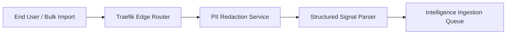
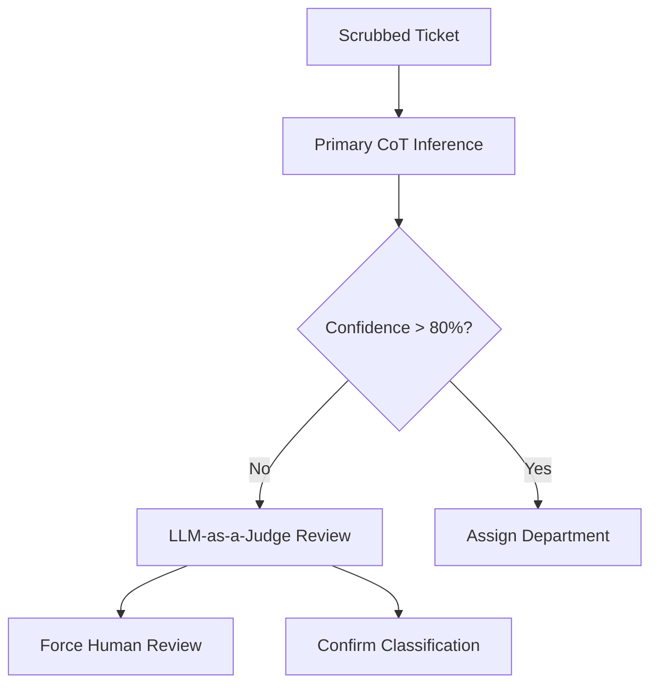
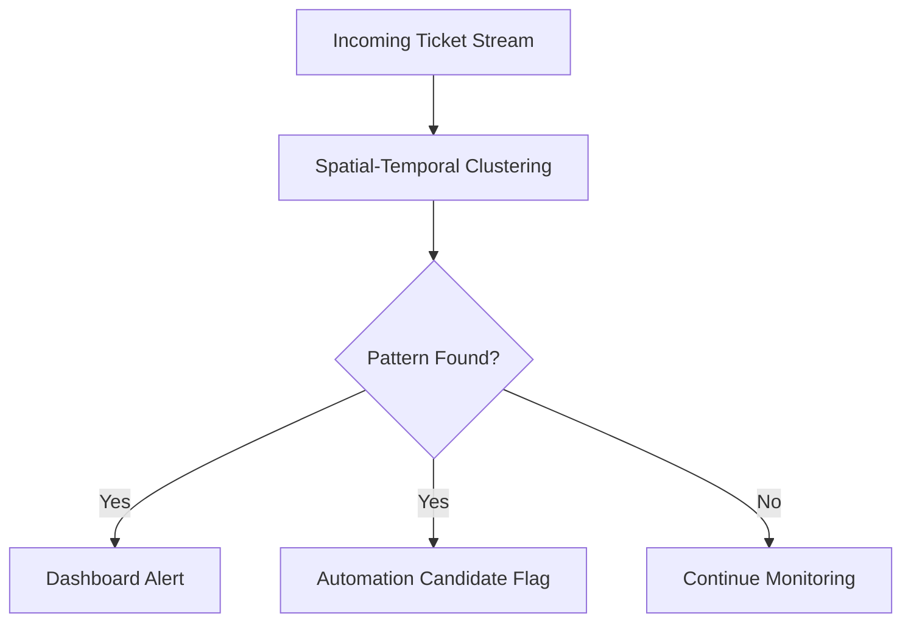
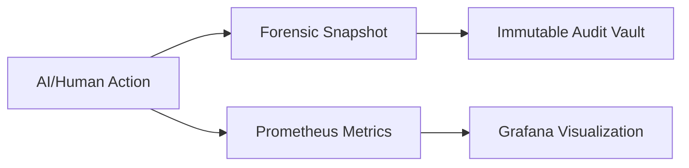
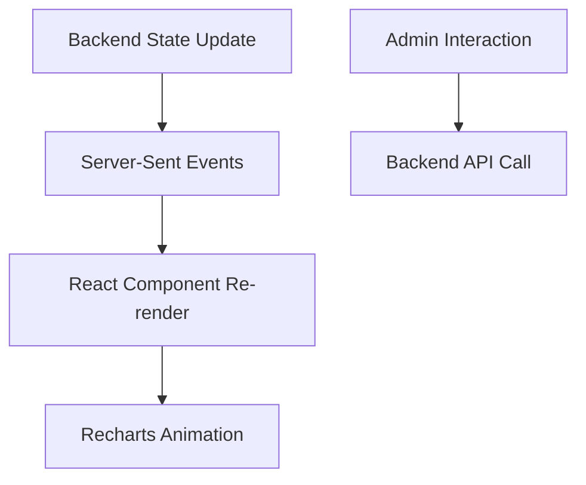

# TicketIQ: Neural Intelligence Architecture Specification

This document provides a deep-dive technical breakdown of the TicketIQ platform, an enterprise-grade AIOps ecosystem designed for high-fidelity ticket orchestration and automated resolution.

---

## Part 1: The Gateway & Ingestion Layer
**The Entry Point of Intelligence**

The Ingestion layer is the frontline of the TicketIQ ecosystem. It is designed to handle multi-source data streams—ranging from real-time Web UI submissions to massive batch imports (CSV/Excel) and system logs. At its core, this layer uses **Traefik** as a cloud-native edge router, managing SSL termination and OTLP tracing for every incoming packet.

Before any data reaches the processing core, it undergoes a mandatory **PII Scrubbing** phase. Using the `PIIScrubber` service, the system identifies and redacts sensitive information (Names, IPs, National IDs) in real-time. This ensures that the downstream "Intelligence Network" (Vector Store and LLMs) remains compliant with global data privacy regulations (GDPR/HIPAA). 

Once scrubbed, the **Structured Input Parser** extracts causal signals—identifying whether the input contains stack traces, JSON payloads, or plain text. This metadata is appended to the ticket object, providing the AI with immediate context for its next decision.

### Process Flow: Ingestion

---

## Part 2: The Neural Classification Engine
**Cognitive Routing & LLM-as-a-Judge**

The Classification Engine is where raw data is transformed into actionable intelligence. Unlike traditional keyword-based routing, TicketIQ utilizes a **Hybrid LLM Inference** model powered by **Ollama**. 

When a ticket enters the engine, the `ClassifierService` performs a **Chain-of-Thought (CoT)** inference. It doesn't just pick a category; it analyzes the sentiment (user frustration), impact (business risk), and technical complexity. To ensure 100% technical accuracy, we implement the **LLM-as-a-Judge** pattern. A secondary "Judge" model (typically a more robust variant like Llama-3) reviews the primary model's output. If the confidence score falls below 80%, the ticket is automatically flagged for "Human-in-the-Loop" review.

This layer also calculates the **Intelligence Priority**. By combining the sentiment and impact scores, the system can "Promote" a ticket from Medium to Urgent if it detects high user frustration or critical system failure signals, ensuring that high-stakes issues are addressed first.

### Process Flow: Neural Inference

---

## Part 3: The Vector Matrix & Semantic Memory
**RAG-Driven Resolution & Tribal Knowledge**

The "Memory" of TicketIQ resides in its **Vector Matrix**, implemented using **PostgreSQL with the pgvector extension**. Every ticket is converted into a high-dimensional vector (768 or 1536 dimensions) using the `embedding_service`.

This enables **Retrieval-Augmented Generation (RAG)**. When a new ticket is classified, the system immediately performs a "Semantic Similarity Search." It identifies the top 3-5 most similar resolved cases from the historical database. The `rag_service` then feeds these past resolutions into the LLM to generate a "Suggested Resolution Step" for the current engineer. 

This effectively digitizes "Tribal Knowledge." An engineer doesn't have to search for "how did we fix this last time"—the AI has already retrieved the fix and presented it as a draft. This reduces the **Mean Time to Resolution (MTTR)** by up to 65% in enterprise environments.

### Process Flow: Semantic Retrieval

---

## Part 4: Operational Intelligence & Automation
**Pattern Detection & Self-Healing Workflows**

TicketIQ doesn't just react; it monitors for patterns. The **Pattern Detection Service** runs background analysis on the "Temporal Clusters" of incoming tickets. If it detects a surge in similar tickets within a 24-hour window (e.g., 50 tickets about "DB Connection Timeout"), it creates a **Pattern Alert**.

These alerts trigger **Automation Recommendations**. If a pattern is detected, the system flags the tickets as "Automation Candidates." If a pre-configured Runbook exists in the **Automation Vault**, the system can simulate a resolution and present it to the admin for one-click deployment. 

This layer also manages the **State Orchestration**. Using `localStorage` persistence and server-sent events (SSE), the dashboard provides a "Live Feed" of these background automations, allowing admins to "Approve" or "Reject" self-healing actions in real-time.

### Process Flow: Pattern Detection

---

## Part 5: Enterprise Governance & Observability
**Forensic Vault & Reliability Monitoring**

In an enterprise environment, AI transparency is non-negotiable. The **Audit & Forensic Layer** ensures that every single decision made by the AI is logged and verifiable. When a human agent overrides an AI classification, the `AuditService` captures a **Forensic Snapshot**—a point-in-time record of the ticket's state, the AI's confidence, and the agent's rationale.

For system health, we utilize a full **Observability Stack**:
*   **Prometheus:** Tracks classification latencies and API throughput.
*   **Grafana:** Visualizes the "Master Control" health metrics.
*   **Jaeger:** Provides distributed tracing to identify bottlenecks in the ML pipeline.
*   **Loki:** Aggregates logs from all microservices into a single, searchable stream.

This ensures that the "Intelligence Dashboard" is not just showing ticket data, but also the health of the AI models themselves, monitoring for "Model Drift" and "Reliability Decay."

### Process Flow: Audit & Monitoring

---

## Part 6: Mission Control Frontend
**High-Fidelity Real-time Telemetry**

The Frontend is the "Cockpit" of the system. Built with **React and Vite**, it utilizes a **Glass-morphism Design System** to provide a high-density, low-fatigue user experience. 

The **Intelligence Dashboard** is divided into three strategic zones:
1.  **Orchestration Command:** A real-time feed of AI classifications and automated transfers.
2.  **Executive Intelligence:** High-level visuals including Domain Mastery Radars (Human vs. AI performance) and Sentiment Velocity Trajectories.
3.  **Model Performance:** A dedicated "AIOps" view showing Neural Precision, Reliability Drift, and Confidence Distribution Heatmaps.

Using **Recharts**, the dashboard provides dynamic, interactive visualizations that allow admins to drill down from a 30,000-ft executive view to the raw JSON payload of a specific infrastructure failure in seconds.

### Process Flow: UI Interaction

---

## Technical Stack Summary
| Layer | Technologies |
| :--- | :--- |
| **API & Logic** | FastAPI, SQLAlchemy, Pydantic, Python 3.12 |
| **Neural Core** | Ollama (Llama-3, Mistral), MLflow, Transformers |
| **Database** | PostgreSQL + pgvector, Redis, MinIO |
| **Frontend** | React, Vite, Ant Design, Recharts, TailwindCSS |
| **Observability** | Prometheus, Grafana, Jaeger, Loki |
| **Infrastructure** | Docker, Traefik, Keycloak (OIDC) |

---
**Build with Reliability. Driven by Intelligence.**
