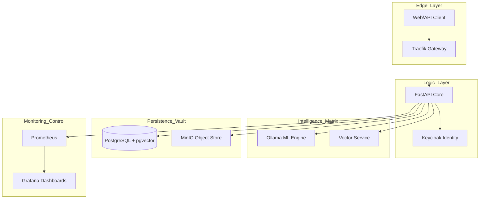
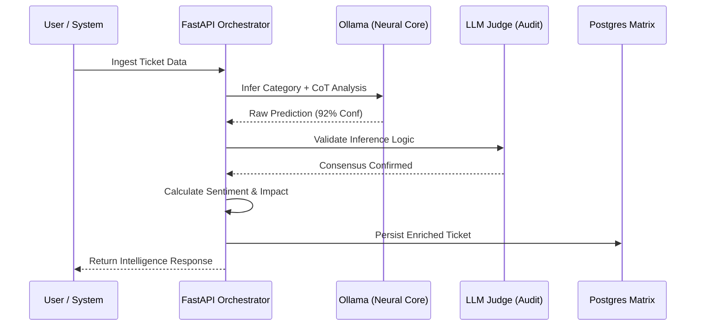
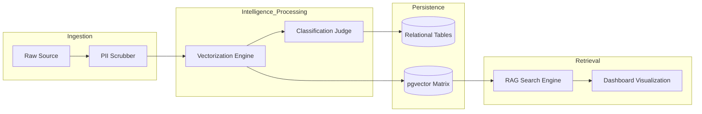
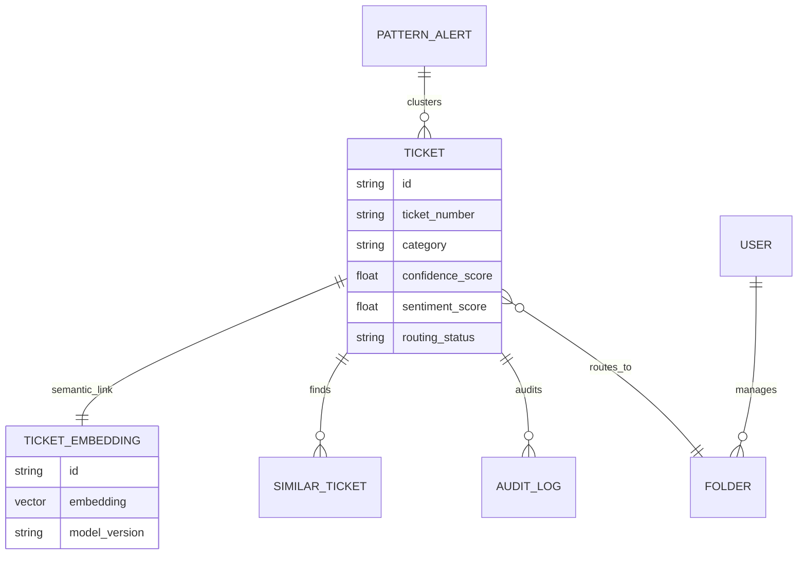
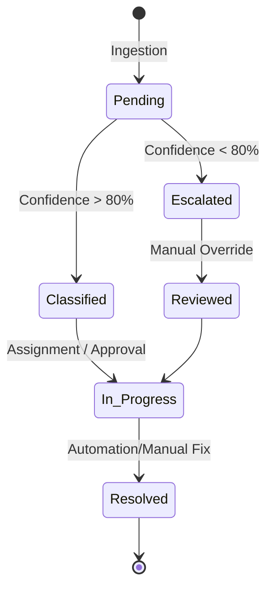

# TicketIQ: Enterprise Neural Intelligence & AIOps Framework
**Technical Whitepaper & Solution Architecture Specification**

---

## Part 1: System Infrastructure & Orchestration Strategy
**Architectural Foundation for Scale and Reliability**

TicketIQ is engineered as a cloud-native, containerized ecosystem designed to address the challenges of high-volume IT Service Management (ITSM). The infrastructure strategy is centered around **Modular Microservices**, ensuring that each component of the intelligence pipeline can be scaled, updated, and monitored independently. By utilizing a containerized approach (Docker), the system achieves 100% environment parity, eliminating the "it works on my machine" paradigm and allowing for seamless deployment across hybrid cloud environments.

At the edge of the infrastructure sits **Traefik**, a modern, cloud-native application proxy. Traefik serves as more than just a load balancer; it is the "Security and Observability Gateway." It handles dynamic SSL termination via Let's Encrypt and manages the routing of traffic to the appropriate microservices based on path prefixes (e.g., `/api` for backend logic, `/` for the React dashboard). Furthermore, Traefik is integrated with **OpenTelemetry (OTEL)**, providing a distributed tracing bridge that follows a request from the initial user click all the way through the neural classification layers.

The logic core is built on **FastAPI**, an asynchronous Python framework. The choice of FastAPI was driven by its native support for Python's `asyncio`, which is critical for handling non-blocking I/O operations—particularly when the system is waiting for responses from the ML models or the database. Under the hood, **Uvicorn** serves as the lightning-fast ASGI server, capable of handling thousands of concurrent connections. This combination ensures that the Intelligence Dashboard remains reactive even during peak incident surges, as the heavy-compute ML tasks are offloaded to background workers, preventing any blocking of the primary event loop.

### System Infrastructure Map

---

## Part 2: Neural Classification & Intelligence Pipeline
**Advanced Inference Chains and Data Sovereignty**

The "Intelligence" in TicketIQ is not a black box; it is a meticulously engineered pipeline designed for **High-Precision Classification**. When a ticket enters the system, it passes through the **Neural Inference Chain**. Unlike basic NLP systems that rely on keyword matching, TicketIQ uses **Large Language Models (LLMs)** via a local **Ollama** instance. This "Local-First" approach is a critical design choice for enterprise security, ensuring that sensitive organizational data never leaves the local infrastructure to be processed by third-party Cloud APIs.

The inference process begins with **Chain-of-Thought (CoT) Prompting**. The system instructs the LLM to "think step-by-step," analyzing the technical symptoms, the affected systems, and the likely root cause before arriving at a category. This significantly reduces hallucinations and increases the accuracy of complex departmental routing. Following the primary inference, the system employs the **LLM-as-a-Judge** pattern. A secondary "Audit Model" reviews the classification output. If there is a discrepancy or if the confidence score is below a threshold (typically 80%), the ticket is marked for **Human-in-the-Loop (HITL)** verification.

Beyond simple categorization, the pipeline performs **Sentiment & Impact Promotion**. Using a specialized scoring algorithm, the system detects user frustration and business risk signals. If a ticket describes a "Global Outage" with a high sentiment score, the **Intelligence Priority** is automatically elevated to `Urgent`, bypassing standard queue positions. This ensures that the most critical issues—those with the highest potential for business disruption—are prioritized by the engineering teams immediately upon ingestion.

### Intelligence Sequence Flow

---

## Part 3: Data Engineering & Governance Architecture
**Sanitized Pipelines and Vector Memory Management**

The data engineering approach in TicketIQ prioritizes **Governance-by-Design**. Every data asset must pass through a strict sanitation pipeline before it is allowed to enter the system's "Long-term Memory." This begins with the **PII Scrubbing Service**. Using a combination of sophisticated Regex patterns and Named Entity Recognition (NER), the scrubber redacts sensitive identifiers such as individual names, personal IP addresses, and national ID numbers. This ensures that the downstream Vector Store remains a clean environment, preventing the accidental leakage of sensitive data during future RAG-based search queries.

Following sanitation, the data enters the **Vectorization Pipeline**. Here, the ticket's title and description are transformed into high-dimensional mathematical representations (Embeddings) using the `embedding_service`. These vectors (typically 768 or 1024 dimensions) are stored in **PostgreSQL using the pgvector extension**. The choice of pgvector allows us to treat vector data as a first-class citizen alongside traditional relational data. We utilize **HNSW (Hierarchically Navigable Small World)** indexing for our vector columns, which provides extremely fast "Nearest Neighbor" searches even as the database grows to millions of records.

This vector store enables **Retrieval-Augmented Generation (RAG)**. When a new ticket is ingested, the system performs a semantic search to find the "Most Similar Resolved Tickets" from the past. By retrieving the resolution steps of these similar cases and feeding them back into the LLM, TicketIQ can generate a "Draft Resolution" for the current ticket. This effectively converts years of historical "Tribal Knowledge" into a searchable, intelligent memory that empowers new engineers to solve complex issues with the speed of a veteran.

### Data Flow Specification (DFD)

---

## Part 4: Neural Data Model (ERD) Specification
**Relational Stability with Vector Agility**

The data model for TicketIQ is a hybrid architecture designed to balance the rigidity of transactional data with the flexibility of AI-generated insights. The schema is built using **SQLAlchemy** and managed with **Alembic** migrations, ensuring that every change to the data structure is version-controlled and reproducible across environments. The central entity is the `Ticket` table, which serves as the "System of Record" for every incident.

To support AIOps features, the model is extended with specialized tables:
*   **TicketEmbedding:** A 1:1 relationship with the Ticket table, storing the vector representations. By decoupling the embeddings from the main ticket table, we improve performance for standard CRUD operations while allowing specialized vector searches to happen in a dedicated index.
*   **SimilarTicket:** A 1:N relationship that stores the "Semantic Linkages" between tickets. This table is populated during the RAG phase and is used by the dashboard to visualize "Related Issue Networks."
*   **PatternAlert:** A standalone entity that tracks "Temporal Clusters" of tickets. When the system detects a recurring issue, it creates a PatternAlert record and links all relevant tickets to it, providing a "Single Source of Truth" for large-scale incident management.

Furthermore, we implement a **Forensic Snapshot** mechanism within our Audit logs. Every time an AI classification is overridden by a human agent, a JSON-serialized snapshot of the ticket's state is captured. This provides an immutable record of "What the AI thought vs. What the Human decided," which is essential for both regulatory compliance and the ongoing fine-tuning of the underlying models.

### Entity Relationship Diagram (ERD)

---

## Part 5: Operational Lifecycle & State Orchestration
**Reactive States and Automated Workflows**

The lifecycle of a ticket in TicketIQ is managed by a **Deterministic State Machine**. Every ticket begins in the `Pending_Classification` state. From here, it can only transition to `Classified` or `Escalated` based on the confidence score generated by the Neural Inference engine. This ensures that no ticket is ever "lost" in the system; every record has a defined path toward resolution.

The system employs **Reactive State Management** for its automation triggers. When a ticket enters the `Classified` state, the `RoutingService` is invoked to map the ticket to a specific departmental folder. This is not a simple database update; it is an "Orchestration Event." The event is published to the **Notification Hub**, which uses Server-Sent Events (SSE) to update the Intelligence Dashboard in real-time. This allows support managers to see tickets "moving" through departments without needing to refresh the page.

For complex issues, we implement **Self-Healing Automation Recommendations**. If a ticket matches a known pattern and has a suggested resolution from the RAG engine, the system transitions the ticket to a `Candidate_for_Automation` status. In the dashboard, this appears as an "Approve Dispatch" prompt. Once an admin approves, the system can execute pre-configured scripts or notifications, transitioning the ticket to `In_Progress` and eventually `Resolved`. This "Human-Approved Automation" model provides the speed of AI with the safety and oversight required by enterprise IT departments.

### State Transition Diagram

---

## Part 6: Enterprise Technology Stack Rationale
**Selection Criteria for High-Reliability AIOps**

| Component | Technology | Enterprise Rationale |
| :--- | :--- | :--- |
| **Backend Core** | FastAPI | Asynchronous performance is non-negotiable for non-blocking ML inferences. Pydantic integration ensures strict data types across the JSON API. |
| **Intelligence Host**| Ollama | Critical for **Data Sovereignty**. By running LLMs locally, we eliminate external dependencies and ensure that sensitive enterprise data never leaves the firewalled infrastructure. |
| **Relational DB** | PostgreSQL | Industry standard for ACID compliance. The extensibility of Postgres allows it to handle both OLTP workloads and Vector searches in a single, unified engine. |
| **Vector Engine** | pgvector | Provides a lower total cost of ownership (TCO) than specialized vector databases (like Pinecone) by keeping the entire data stack within a single Postgres instance. |
| **Frontend UI** | React + Vite | Vite provides a "Zero-Lag" development and build cycle. React's component-based architecture allows us to build complex, real-time widgets (Gauges, Trajectories) efficiently. |
| **Auth & Identity** | Keycloak | Implements OIDC and OAuth2 protocols out of the box. Provides a centralized vault for user permissions and service-to-service authentication. |
| **Observability** | Prometheus/Grafana | The "Golden Standard" for cloud-native monitoring. Provides real-time alerting and visualization of the entire system's technical health. |

---
**This Technical Specification represents the blueprint for a next-generation AIOps ecosystem, combining the reliability of enterprise software with the transformative power of Neural Intelligence.**
